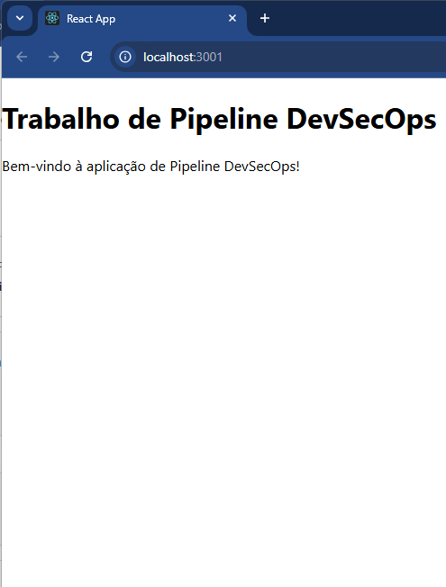
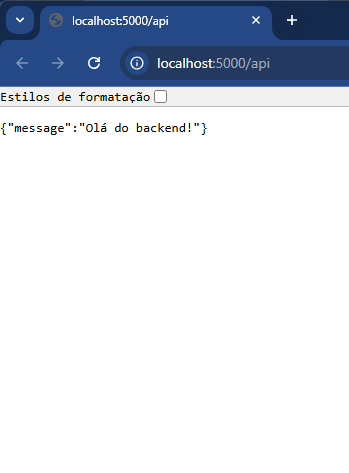

# 🚀 DevSecOps Pipeline Example
Este repositório demonstra um pipeline CI/CD completo usando GitHub Actions , Docker , e uma aplicação com frontend em React , backend em Node.js (Express) e banco de dados PostgreSQL.</br>O objetivo é mostrar como integrar práticas de DevSecOps, SRE e Quality Assurance em um fluxo de trabalho moderno.

## 📋 Índice

1. [Visão Geral](#visao-geral)
2. [Captura de telas](#captura-de-telas)
3. [Tecnologias Utilizadas](#tecnologias-utilizadas)
4. [Estrutura do Projeto](#estrutura-do-projeto)
5. [Pré-requisitos](#pre-requisitos)
6. [Como Executar Localmente](#como-executar-localmente)
7. [Pipeline CI/CD](#pipeline-cicd)
8. [Contribuição](#contribuicao)
9. [Licença](#licenca)

## 🌟 Visão Geral<a id="visao-geral"></a>
Este projeto simula uma aplicação web simples com:

Frontend : Uma interface React que exibe uma mensagem de boas-vindas.</br>
Backend : Um servidor Node.js com Express que fornece uma API simples.</br>
Banco de Dados : PostgreSQL para armazenamento de dados (opcional).</br>
O pipeline CI/CD automatiza os processos de build , teste e deploy usando GitHub Actions e Docker .

## Capturas de Tela<a id="captura-de-telas"></a>

<div align="center">
  <table>
    <tr>
      <td align="center">
        
        <br><b>Tela Localhost 3001</b>
      </td>
      <td align="center">
        
        <br><b>Tela Localhost 5000</b>
      </td>      
    </tr>
  </table>
</div>


## 💻 Tecnologias Utilizadas<a id="tecnologias-utilizadas"></a>

**Frontend**:
* React
* Docker

**Backend**:
* Node.js
* Express
* Docker

**Banco de Dados**:
* PostgreSQL

**Ferramentas**:
* Docker Compose
* GitHub Actions
* NPM

## 📂 Estrutura do Projeto<a id="estrutura-do-projeto"></a>
```
devsecops-pipeline/
├── frontend/          # Aplicação React (frontend)
│   ├── public/
│   ├── src/
│   ├── package.json
│   └── Dockerfile
├── backend/           # Servidor Node.js (backend)
│   ├── app.js
│   ├── package.json
│   └── Dockerfile
├── docker-compose.yml # Configuração do Docker Compose
├── .github/           # Configuração do GitHub Actions
│   └── workflows/
│       └── pipeline.yml
└── README.md          # Este arquivo
```

## ⚙️ Pré-requisitos<a id="pre-requisitos"></a>
Certifique-se de ter as seguintes ferramentas instaladas:

* Node.js (v16 ou superior): [Download](https://nodejs.org/)
* Docker Desktop: [Download](https://www.docker.com/products/docker-desktop/)
* Git: [Download](https://git-scm.com/downloads)
* VSCode (recomendado): [Download](https://code.visualstudio.com/)

## ▶️ Como Executar Localmente<a id="como-executar-localmente"></a>
1. Clone o Repositório
git clone https://github.com/seu-usuario/devsecops-pipeline.git
cd devsecops-pipeline

2. Inicie os Serviços com Docker Compose
docker-compose up -d

3. Acesse a Aplicação
Frontend : http://localhost:3001
Backend API : http://localhost:5000/api

4. Pare os Serviços
docker-compose down

## 🔄 Pipeline CI/CD<a id="pipeline-cicd"></a>
O pipeline automatiza os seguintes passos:

Build :
Instala dependências e constrói o frontend e o backend.
Teste :
Executa testes no frontend e no backend.
Deploy :
Inicia os serviços com Docker Compose.
Arquivo: .github/workflows/pipeline.yml

## 👥 Contribuição<a id="contribuicao"></a>
Contribuições são bem-vindas! Para contribuir:

Faça um fork deste repositório.
Crie uma branch para sua feature (git checkout -b feature/nova-feature).
Commit suas alterações (git commit -m 'Adiciona nova feature').
Envie para o repositório remoto (git push origin feature/nova-feature).
Abra um Pull Request.


## 📜 Licença<a id="licenca"></a>
Este projeto está licenciado sob a MIT License . Veja o arquivo LICENSE para mais detalhes.

## 🙌 Agradecimentos
Agradeço ao @FabianoCarneiro do curso DevSecOps por inspirar este projeto.

E agradeço a você por conferir este repositório! 😊
